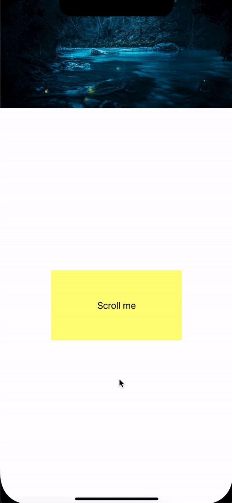

# OYStretchyHeader



Installation
------------

### CocoaPods

Just add `pod 'OYStretchyHeader'` to your Podfile then run `pod install` or `pod update`.

In any file you'd like to use OYStretchyHeader in, don't forget to
import the framework with `import OYStretchyHeader`.

### Manually
Download and drop OYStretchyHeader.swift in your project.


Usage
---

```swift
   OYStretchyHeader().init(viewController: self,
                                      parentView: scrollView,
                                      customHeader: nil,
                                      image: UIImage(named: "sample"),
                                      height: 200,
                                      type: .afterShowNavigationBar)
```                                
                                      
you can select one of the types
  
  ```swift
  public enum HeaderType {
    case afterShowNavigationBar
    case alwaysHideNavigationBar
    case alwaysShowNavigationBar
}
```

License
-------

OYStretchyHeader is released under an MIT license. See ``LICENSE`` for more information.
